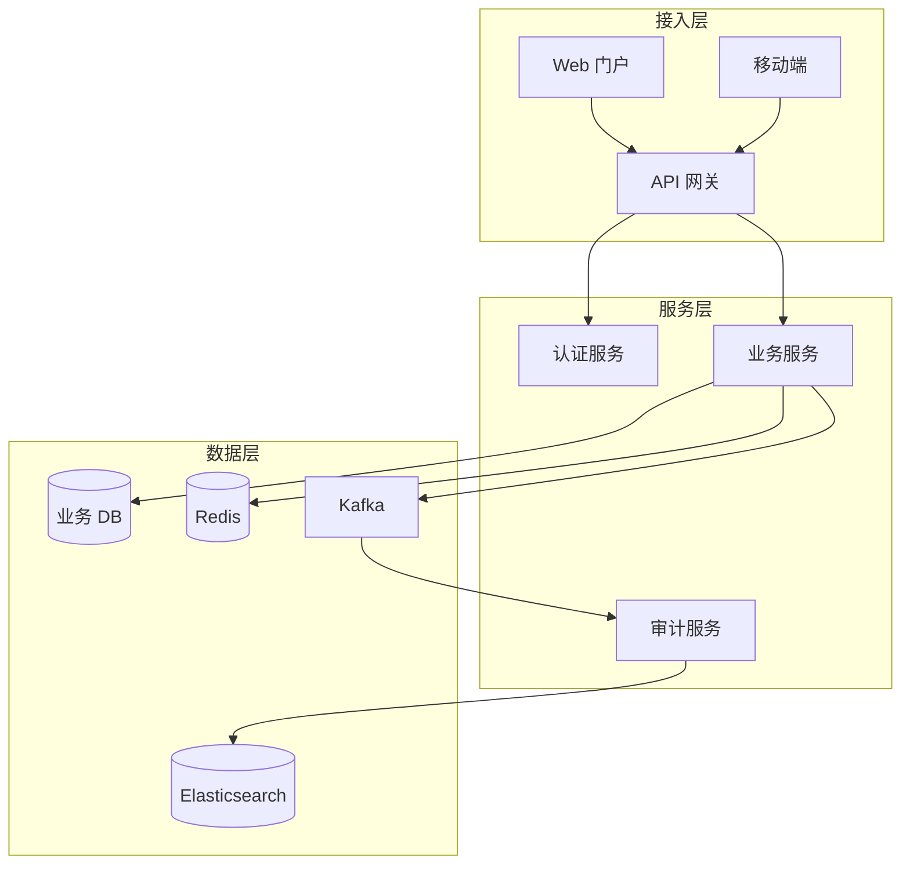
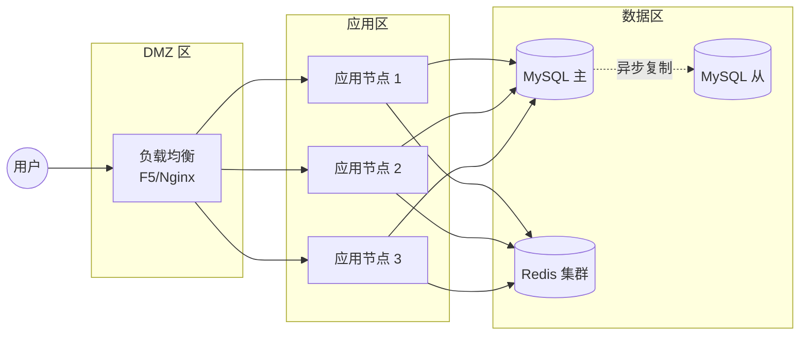
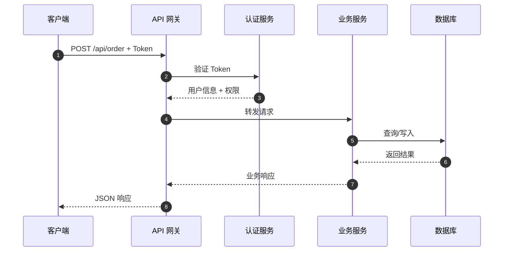
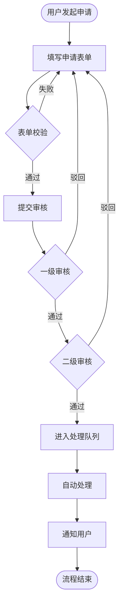
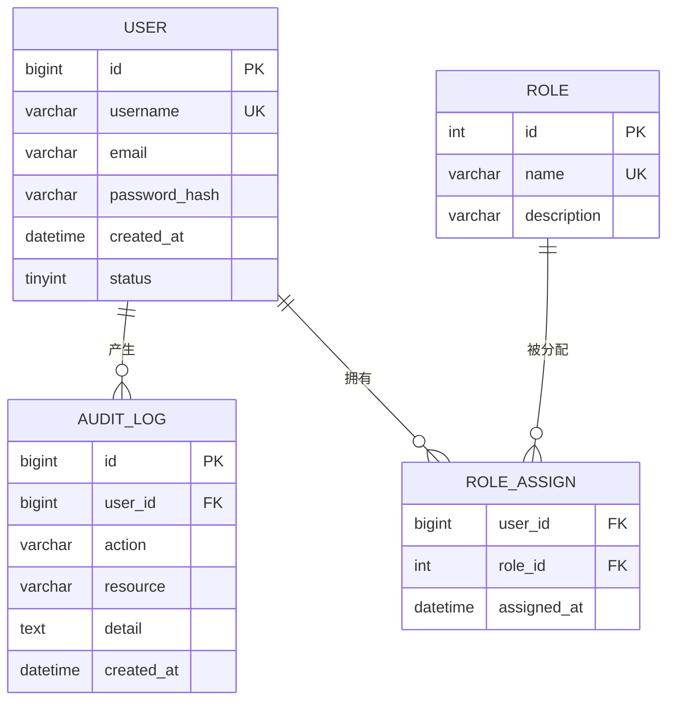
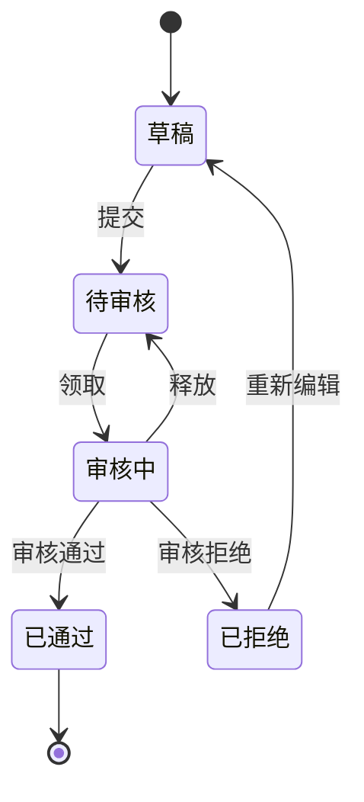
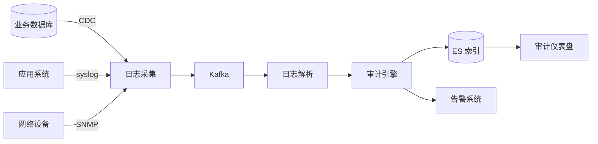
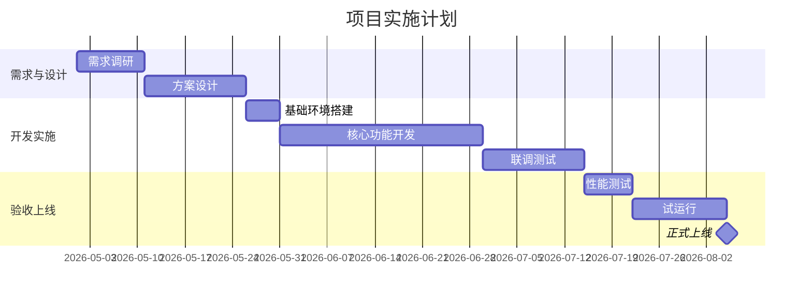

# 技术文档常用 Mermaid 图 & 表格模板

选对图类型是关键。先看"何时用什么图"速查表，然后对照模板改。

## 速查：何时用什么图

| 场景 | 推荐类型 |
|------|---------|
| 系统整体架构（分层） | `flowchart TB` + `subgraph` |
| 部署拓扑 | `flowchart LR` + `subgraph` |
| 跨服务调用 / 接口时序 | `sequenceDiagram` |
| 业务流程 / 算法 | `flowchart LR` 或 `TD` |
| 数据模型 | `erDiagram` |
| 状态流转 / 审批流 | `stateDiagram-v2` |
| 项目进度 / 里程碑 | `gantt` |
| 组织结构 / 类继承 | `flowchart` 或 `classDiagram` |

---

## 1. 系统架构图（分层架构）

## 2. 部署拓扑图

## 3. 接口调用时序图

## 4. 业务流程图

## 5. 数据模型 ER 图

## 6. 状态机（审批流 / 生命周期）

## 7. 数据流图

## 8. 甘特图（项目进度）

---

## 表格模板

### 接口 — 请求参数表

| 参数名 | 类型 | 必选 | 说明 | 示例 |
|--------|------|:----:|------|------|
| user_id | bigint | 是 | 用户 ID | 10086 |
| name | string | 否 | 姓名，最长 50 字符 | 张三 |
| status | int | 否 | 状态，枚举值 0/1/2，默认 0 | 1 |
| created_after | string | 否 | 筛选起始时间，ISO8601 | 2026-04-01T00:00:00Z |

### 接口 — 返回字段表

| 字段名 | 类型 | 说明 |
|--------|------|------|
| code | int | 状态码，0 表示成功 |
| message | string | 提示信息 |
| data | object | 业务数据 |
| data.list | array | 记录列表 |
| data.total | int | 总记录数 |

### 接口 — 错误码表

| 错误码 | HTTP | 含义 | 处置建议 |
|--------|:----:|------|---------|
| 0 | 200 | 成功 | — |
| 40001 | 400 | 参数错误 | 检查请求参数 |
| 40101 | 401 | 未认证 | 重新登录获取 Token |
| 40301 | 403 | 权限不足 | 申请对应角色 |
| 42901 | 429 | 请求过于频繁 | 降低请求频率后重试 |
| 50000 | 500 | 服务内部错误 | 联系技术支持 |

### 数据表 — 字段定义表

| 字段名 | 类型 | 非空 | 默认值 | 说明 |
|--------|------|:----:|--------|------|
| id | bigint unsigned | 是 | AUTO_INCREMENT | 主键 |
| user_id | bigint unsigned | 是 | — | 用户 ID，外键 → user.id |
| action | varchar(64) | 是 | — | 操作类型 |
| detail | text | 否 | NULL | 操作详情 JSON |
| created_at | datetime | 是 | CURRENT_TIMESTAMP | 创建时间 |

### 性能指标表

| 指标 | 目标值 | 测试方法 |
|------|-------|---------|
| 单接口 TPS | ≥ 1000 | JMeter 压测，100 并发持续 10 分钟 |
| 平均响应时间 | ≤ 200ms | 生产环境 APM 7 日均值 |
| P99 响应时间 | ≤ 500ms | 同上 |
| 年可用性 | ≥ 99.9% | 全年累计不可用时间 ≤ 8.76 小时 |

### 方案对比表（架构文档常用）

| 维度 | 方案 A：MySQL | 方案 B：PostgreSQL | 方案 C：TiDB |
|------|--------------|-------------------|-------------|
| 扩展性 | 中等（需分库分表） | 中等 | 强（原生分布式）|
| 事务支持 | 强 | 强 | 强 |
| JSON 查询 | 一般 | 强 | 一般 |
| 团队熟悉度 | 高 | 低 | 中 |
| 运维成本 | 低 | 中 | 高 |
| 推荐度 | ★★★★ | ★★★ | ★★ |

---

## 画图注意事项

1. **节点数量**：一张图尽量不超过 15-20 个节点，多了就拆分
2. **图的方向**：
   - `TB`（上到下）适合分层架构
   - `LR`（左到右）适合流程、部署拓扑
3. **中文**：Mermaid 原生支持中文，但节点 ID 用英文更稳妥（显示内容可以是中文）
4. **样式**：技术文档画图保持朴素，避免过多颜色和装饰
5. **可读性优先**：宁可分成两张简单的图，也不要一张巨复杂的图
