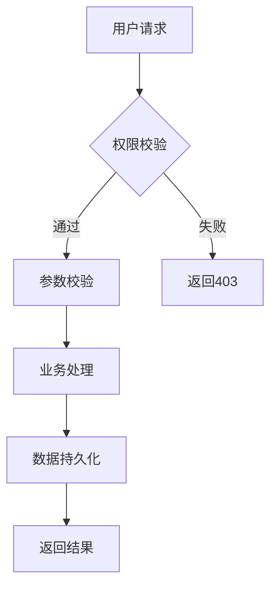

# pd-prd-writing · PRD与需求文档

> **核心定位**：回答"产品文档怎么写"——把需求分析结果翻译成开发能执行、测试能验证的产品需求文档。
> **NPDP对标**：Ch3 新产品开发流程（需求规格化阶段）

## 法规与标准依据

| 标准/框架 | 关联内容 |
|-----------|----------|
| NPDP Body of Knowledge | Ch3 需求规格化与文档化 |
| IEEE 830 | 软件需求规格说明(SRS)标准 |
| ISO/IEC/IEEE 29148 | 需求工程生命周期过程 |
| GB/T 8567 | 计算机软件文档编制规范 |

---

## 前置条件与输入

| 输入项 | 来源 | 必要性 |
|--------|------|--------|
| 需求清单(含KANO分类) | pd-requirements-design | 必须 |
| 用户故事(含AC) | pd-requirements-design | 必须 |
| 需求跟踪矩阵(RTM) | pd-requirements-design | 必须 |
| 产品战略与路线图 | pd-product-strategy | 必须 |
| 竞品分析结论 | pd-market-research | 建议 |

---

## 核心工作流程

### Step 1：确定文档类型

**3层文档体系**：

| 文档类型 | 受众 | 核心回答 | 页数 | 时机 |
|----------|------|----------|------|------|
| **BRD**（商业需求文档） | 老板/投资方 | "值不值得做" | 3-5页 | 立项阶段 |
| **MRD**（市场需求文档） | 产品/市场团队 | "市场有多大、用户是谁" | 5-10页 | Go/No-Go后 |
| **PRD**（产品需求文档） | 研发/设计/测试 | "具体做成什么样" | 10-30页 | 需求定义阶段 |

**选择决策树**：

```
老板只给了一句话"做个XX" → BRD（先说服他值得做）
确定了要做但还没研究市场 → MRD（先搞清楚市场）
已经清楚做什么怎么做 → PRD（直接写执行文档）
```

### Step 2：8模块PRD标准模板

**完整PRD骨架（可直接复制使用）**：

```markdown
# [产品名称] 产品需求文档

## 1. 文档信息
| 项目 | 内容 |
|------|------|
| 产品名称 | |
| 版本号 | V1.0 |
| 作者 | |
| 创建日期 | YYYY-MM-DD |
| 最后更新 | YYYY-MM-DD |
| 文档状态 | ☐草稿 ☐评审中 ☐已确认 |

## 2. 产品概述
### 2.1 产品愿景
[一句话描述产品要成为什么]

### 2.2 目标用户
[用户画像，引用pd-user-research的Persona]

### 2.3 核心问题
| # | 用户痛点 | 现有方案 | 我们的差异化 |
|---|----------|----------|-------------|
| 1 | | | |

## 3. 功能需求
### 3.1 功能列表
| 需求ID | 功能名称 | KANO类型 | 优先级 | 用户故事ID | 版本 |
|--------|----------|----------|--------|-----------|------|
| F001 | | M/O/A | P0/P1/P2 | US001 | V1.0 |

### 3.2 功能详细说明
[每个P0/P1功能，按以下结构展开]

#### F001: [功能名称]
- **用户故事**：作为[角色]，我想要[动作]，以便于[价值]
- **验收标准**：
  - AC1: Given... When... Then...
  - AC2: Given... When... Then...
- **交互说明**：[操作流程/状态变化]
- **异常处理**：[错误场景+提示文案]
- **数据要求**：[字段/格式/校验规则]

## 4. 非功能需求
[引用pd-requirements-design的8维度，按需填写]

| 维度 | 要求 | 验收标准 |
|------|------|----------|
| 性能 | | |
| 安全性 | | |

## 5. 信息架构
[站点地图/导航结构图]

## 6. 交互设计
[关键页面线框图/原型链接]

## 7. 数据埋点
### 7.1 核心埋点清单
| 事件名 | 触发时机 | 属性 | 用途 |
|--------|----------|------|------|
| page_view | 页面加载 | page_name, source | PV/UV统计 |
| btn_click | 按钮点击 | btn_name, position | 转化漏斗 |

### 7.2 数据看板需求
| 看板名称 | 指标 | 刷新频率 |
|----------|------|----------|
| | | |

## 8. 发布计划
| 版本 | 功能范围 | 目标日期 | 关键里程碑 |
|------|----------|----------|-----------|
| V1.0 | P0+核心P1 | | |

## 附录
- 需求跟踪矩阵(RTM)
- 术语表
- 竞品参考
```

### Step 3：一页纸PRD（敏捷项目快速模板）

**适用场景**：小需求/迭代/Sprint级别需求，不需要完整8模块

```markdown
# [功能名称] - 一页纸PRD

## 背景 & 目标
为什么要做？预期什么效果？（2-3句话）

## 用户故事
作为[角色]，我想要[动作]，以便于[价值]

## 验收标准
- [ ] AC1: ...
- [ ] AC2: ...
- [ ] AC3: ...

## 交互/设计
[线框图/Figma链接]

## 埋点
| 事件 | 属性 | 用途 |
|------|------|------|

## 不做
[明确排除的scope，防止scope creep]

## 依赖 & 风险
- 依赖：[API/设计/第三方]
- 风险：[可能阻塞的问题]
```

### Step 4：数据埋点设计

**埋点设计4步法**：

```
Step 1: 定义业务问题
  "我想知道什么？" → 例如：用户为什么在注册第3步流失？

Step 2: 选择分析模型
  漏斗分析 → 埋点：每个步骤的page_view + btn_click
  留存分析 → 埋点：login + key_action
  路径分析 → 埋点：每个页面的page_view + 来源参数

Step 3: 编写埋点清单
  事件名：snake_case命名（如 user_register_step3_submit）
  属性：key=value（如 step=3, method=phone, result=success）

Step 4: 验证埋点
  上线前：用DebugView确认事件触发和属性正确
  上线后：第1天检查数据是否正常上报
```

**埋点命名规范**：

| 类别 | 命名格式 | 示例 |
|------|----------|------|
| 页面浏览 | `page_{页面名}` | `page_home`, `page_order_detail` |
| 按钮点击 | `click_{位置}_{动作}` | `click_header_search`, `click_card_share` |
| 业务事件 | `{模块}_{动作}_{结果}` | `register_submit_success` |
| 系统事件 | `sys_{事件}` | `sys_error_api`, `sys_crash` |

### Step 5：需求变更管理

**需求变更3级分类**：

| 级别 | 定义 | 处理方式 | 审批人 |
|------|------|----------|--------|
| **轻微** | 不影响功能逻辑的文案/样式调整 | 直接改，下一版更新PRD | PM自行决定 |
| **一般** | 新增/修改功能但不变更核心scope | 评估影响→更新PRD→通知相关人 | PM+技术负责人 |
| **重大** | 变更核心scope/影响架构/变更交付时间 | 评估→CCB审批→更新PRD→通知所有干系人 | CCB（见pm-change-management） |

**变更记录模板**：

| 变更ID | 日期 | 变更描述 | 级别 | 影响范围 | 审批人 | PRD版本 |
|--------|------|----------|------|----------|--------|---------|
| CR001 | | | 轻微/一般/重大 | | | V1.0→V1.1 |

### Step 6：文档版本控制

**版本号规则**：

```
V[主版本].[次版本].[修订号]

主版本：重大功能变更/架构调整（V1→V2）
次版本：新增功能模块（V1.0→V1.1）
修订号：文案修正/错别字（V1.1.0→V1.1.1）

示例：
V1.0 — 初稿
V1.0-draft → V1.0-review → V1.0-approved
V1.1 — 新增XX功能（CR001）
```

**文档状态流转**：

```
草稿(draft) → 评审中(review) → 已确认(approved) → 已归档(archived)
                                         ↓
                                    已变更(changed) → 评审中(review)
```

---

## 详细设计说明（DDD模板）

> **适用场景**：当PRD的"功能详细说明"不够细（开发无法直接编码）时，需要输出DDD。一般ToG/ToB复杂模块需要DDD，2C小功能可省略。

**DDD与PRD的区别**：

| 维度 | PRD | DDD |
|------|-----|-----|
| 回答的问题 | 做什么(What) | 怎么做(How) |
| 受众 | 产品/设计/测试/开发 | 开发/架构/测试 |
| 语言 | 业务语言 | 技术语言 |
| 抽象层级 | 用户视角 | 系统视角 |

### DDD模板结构

DDD文档应包含以下6个核心章节：

**第1章：设计概述** — 用技术语言描述本模块要解决的问题

**第2章：模块结构与依赖** — 描述入口层/业务逻辑层/数据持久层的职责划分

**第3章：核心逻辑流程图** — 使用Mermaid绘制主流程

示例：


**第4章：接口定义** — 定义API的请求方式/路径/参数/响应/错误码

**第5章：数据模型** — 数据库表设计 + 缓存设计

**第6章：异常处理** — 各类异常场景的处理策略

### DDD完整模板（可直接复制）

```markdown
# [模块名称] 详细设计说明书

## 1. 设计概述
[用技术语言描述本模块要解决的问题]

## 2. 模块结构与依赖
- **入口层**：Controller / API Endpoint
- **业务逻辑层**：Service 职责划分
- **数据持久层**：DAO/Repository

## 3. 核心逻辑流程图

（使用Mermaid绘制，见上方示例）

## 4. 接口定义
### 4.1 [接口名称]
- **请求方式**：POST
- **请求路径**：/api/v1/xxx
- **请求参数**：...
- **响应参数**：...
- **错误码**：...

## 5. 数据模型
### 5.1 数据库表设计
| 字段名 | 类型 | 说明 | 约束 |
|--------|------|------|------|
| id | bigint | 主键 | PK |

### 5.2 缓存设计
- 缓存Key：xxx:{id}
- TTL：3600s
- 更新策略：Cache Aside

## 6. 异常处理
| 异常场景 | 处理策略 |
|----------|----------|
| 网络超时 | 重试3次 |
| 服务不可用 | 降级处理 |
```

### DDD实操建议

- DDD可以和PRD合并为一份文档（PRD含DDD附录），也可以独立成文档
- ToG项目建议独立成文档（验收时需要）
- 2C敏捷项目建议合并（减少文档维护成本）
- 小型功能（≤3个API）可省略DDD，在PRD中直接写清楚即可

---

## 参考资料¶

> 本 SKILL 有以下可直接使用的模板文件（位于 `references/` 目录）：

| 模板文件 | 用途 |
|-----------|------|
| `prd-template.md` | 完整8模块PRD模板（含OKR/需求池/非功能需求等） |
| `one-pager-prd.md` | 一页纸PRD模板（敏捷迭代/小功能适用） |

---

## 即用工具

### 工具1：PRD发布前12项检查清单

```
☐ 1. 文档信息完整（作者/版本/状态/日期）
☐ 2. 产品愿景是否清晰（一句话能说清）
☐ 3. 目标用户是否明确（有Persona支撑）
☐ 4. 功能列表是否含KANO分类和优先级
☐ 5. 每个P0/P1功能是否有验收标准(AC)
☐ 6. 验收标准是否可测试（Given-When-Then）
☐ 7. 非功能需求是否已定义（8维度）
☐ 8. 信息架构是否已设计
☐ 9. 埋点清单是否已编写
☐ 10. 不做的功能是否已明确（防scope creep）
☐ 11. 需求跟踪矩阵(RTM)是否已更新
☐ 12. 与产品路线图是否对齐
```

### 工具2：BRD快速模板

```markdown
# [产品名称] 商业需求文档

## 1. 产品机会（为什么做）
- 市场规模：[TAM/SAM/SOM]
- 用户痛点：[Top 3]
- 竞品差距：[我们有什么别人没有的]

## 2. 产品方案（做什么）
- 核心功能：[3-5个]
- 差异化价值：[1-2句话]

## 3. 商业价值（值多少）
- 收入预期：[第1年/第2年/第3年]
- 投入估算：[人力/时间/资金]
- ROI：[预计X倍]

## 4. 风险与对策
| 风险 | 概率 | 影响 | 对策 |
|------|------|------|------|
| | 高/中/低 | 高/中/低 | |

## 5. 里程碑
| 时间 | 里程碑 | 交付物 |
|------|--------|--------|
| | | |
```

---

## 踩坑预警

| # | 坑点 | 表现 | 规避 |
|---|------|------|------|
| 1 | **PRD写成了功能堆砌** | 罗列一堆功能但没说为什么 | 每个功能必须关联用户故事和价值 |
| 2 | **验收标准写"体验流畅"** | 开发和测试无法判断是否完成 | 必须用Given-When-Then写可测试的AC |
| 3 | **跳过埋点设计** | 上线后才发现没有数据看 | PRD必须包含埋点清单，和功能一起评审 |
| 4 | **不做"不做什么"** | 开发过程不断加需求（scope creep） | PRD必须明确"不做"清单 |
| 5 | **文档只写不改** | PRD改了但文档没更新 | 变更必须同步更新PRD+RTM |
| 6 | **非功能需求缺失** | 上线后性能/安全问题频出 | 8维度逐项检查，ToG项目必须包含等保 |
| 7 | **BRD/PRD混用** | 给老板看PRD、给开发看BRD | 按受众选文档类型（见Step 1决策树） |

---

## 政企产品专项支持（ToG/ToB）

### ToG PRD特殊章节

**必须增加的章节**：

| 章节 | 内容 | 为什么 |
|------|------|--------|
| 合规要求 | 等保定级、数据安全法要求 | 政府项目合规是硬门槛 |
| 国产化适配 | 信创要求（麒麟/统信+龙芯/飞腾） | 政府采购强制要求 |
| 数据接口规范 | 与上级平台对接（如政务大数据平台） | 政府信息化强调互联互通 |
| 审计日志要求 | 操作留痕6个月+ | 政府审计要求 |
| 验收标准 | 对标招标文件技术参数 | 项目以验收为终点 |

**ToG PRD模板增量**：

```markdown
## 政务专项要求

### 合规要求
| 要求 | 标准 | 定级/等级 |
|------|------|----------|
| 等保 | GB/T 22239-2019 | ☐二级 ☐三级 |
| 密码 | GM/T 0054 | |
| 信创 | 国产化比例≥__% | |

### 系统对接
| 对接系统 | 接口方式 | 数据方向 |
|----------|----------|----------|
| 政务大数据平台 | API/消息队列 | 推送/拉取 |

### 验收指标
[直接引用招标文件技术参数表]
```

### ToB PRD特殊考量

| 维度 | 差异 | 处理方式 |
|------|------|----------|
| 定制需求 | KA客户定制 vs 标准产品 | 定制需求单独立项，PRD标注"定制" |
| SLA | 不同等级客户不同SLA | PRD中定义SLA等级矩阵 |
| 数据隔离 | 多租户数据隔离要求 | 非功能需求中明确隔离策略 |

---

## 元数据（GOV v3.0 治理字段）

> Track: `S`（共用层）| Phase: `P4`（执行）| Sub-position: `P4-a 文档交付`
> Issue Type: `DELIVERY_WRITING`
> Knowledge Sources: [NPDP Ch3, IEEE 830, ISO/IEC/IEEE 29148, GB/T 8567]
> Review Cadence: `quarterly`

## 与文档出版工具的协作接口（doc-versioner）

> PRD 内容确认后，使用 **doc-versioner** skill 完成版本化出版。两者形成完整链路：
> `pd-prd-writing`（写内容） → `doc-versioner`（出版版本化快照）

### 协作流程

| 步骤 | 操作 | doc-versioner 入口 |
|:---:|------|:----------|
| 1 | PRD 内容定稿，保存为无版本号源 `.md` 文件 | — |
| 2 | 初始化源文档（首次） | `gen_template.js --output-dir <dir> --basename <名称> --title <标题> --system <系统名>` |
| 3 | 更新源文档后生成版本化快照 | `gen_from_md.js --source <源文件> --output-dir <输出目录>` |
| 4 | 批量出版多个 PRD | `gen_from_md.js --manifest <manifest文件>` |
| 5 | 归档旧快照 | 脚本自动将旧版本移入 `backup/` |

### 分工边界

| 事项 | pd-prd-writing | doc-versioner |
|------|-----------------|-----------|
| PRD 内容撰写 | ✅ 负责 | ❌ 不做 |
| 8 模块模板结构 | ✅ 提供内容模板 | ❌ 不做 |
| 版本号管理 | ✅ 定义版本规则 | ✅ 按规则生成 `{name}_{version}.md` |
| 文档 Snapshot 归档 | ❌ 不做 | ✅ 负责（自动移入 `backup/`） |
| 等保合规基线 | ✅ 引用通用要求 | ✅ 维护 `references/通用等保三级安全要求.md` |

### 使用提醒

- PRD 写完并确认后，主动提示用户："内容已完成，是否使用 doc-versioner 生成版本化快照？"
- 若 PRD 涉及等保功能点，在 `7.1 合规与安全要求` 章节引用 doc-versioner 的通用等保基线文件

---

## ITTO 契约（GOV v3.0 治理字段）

### Input（输入 — 可验证）

| 类型 | 字段名 | 格式/说明 | 来源 |
|:----:|:------|:---------|:-----|
| [M] | 需求清单（含 KANO 分类） | Markdown 表格 | pd-requirements-design |
| [M] | 用户故事（含 AC） | INVEST 格式 | pd-requirements-design |
| [M] | 需求跟踪矩阵（RTM） | Markdown 表格 | pd-requirements-design |
| [M] | 产品战略与路线图 | Markdown | pd-product-strategy |
| [O] | 竞品分析结论 | Markdown | pd-market-research |
| [O] | 源文档路径（出版时用） | 绝对路径 `.md` | 用户 / doc-versioner |

### Tools & Techniques（处理逻辑 — 可追溯）

| 步骤 | 方法 | 标准出处 | 说明 |
|:---:|------|:--------|------|
| 1 | 确定文档类型（BRD/MRD/PRD） | NPDP Ch3 | 按受众和时机选择 |
| 2 | 填写 8 模块 PRD 模板 | IEEE 830 / GB/T 8567 | 含验收标准 AC |
| 3 | 数据埋点设计 |  analytics 规范 | 事件命名 + 属性定义 |
| 4 | 需求变更管理 | PMP 变更控制 | CR 分级 + CCB 审批 |
| 5 | 文档版本控制 | NPDP 文档管理 | 主.次.修订号规则 |

**Branch Conditions（场景分支）：**

| 条件 | 触发时机 | 处理差异 |
|:----|:--------|:--------|
| 敏捷小需求 | 功能 ≤ 3 个，无复杂依赖 | 输出一页纸 PRD，跳过完整 8 模块 |
| ToG 项目 | 涉及等保 / 信创要求 | 增加政务专项章节，引用 doc-versioner 等保基线 |
| 已有源文档 | 用户提供了无版本号 `.md` 源文件 | 内容更新后 handoff 到 doc-versioner 出版 |

### Output（输出 — 有验收标准）

| 类型 | 输出项 | 格式 Schema | 验收标准 |
|:----:|:------|:----------|:--------|
| 主要 | PRD 内容（BRD/MRD/PRD） | Markdown，含固定章节 [1.文档信息-8.发布计划] | 所有 [M] 输入已转化为章节内容 |
| 主要 | 一页纸 PRD（敏捷场景） | Markdown，含背景/用户故事/AC/不做 | AC 条数 ≥ 功能条数 |
| 附加 | 数据埋点清单 | Markdown 表格 [事件名/属性/用途] | 每个 P0/P1 功能至少 1 个埋点 |
| 附加 | 需求变更记录 | Markdown 表格 [CR ID/级别/影响] | CR 分级规则已应用 |

### Boundary（边界声明）

| 方向 | 声明 |
|:---:|:-----|
| **不做** | 不执行代码；不生成版本化快照文件（交由 doc-versioner）；不做项目施工进度管理 |
| **不追问** | 不追问用户公司机密战略；不追问个人隐私信息 |
| **不收口** | 内容定稿后 handoff 到 `doc-versioner` 做版本化出版；ToG 等保细节 handoff 到 `pd-requirements-design` |
| **下游** | `doc-versioner`（文档出版）→ `pm-requirements-scope`（范围基线）→ `pm-schedule-cost`（排期） |

---

## 与项目管理团队的协作接口

```
pd-prd-writing                   pm-suite
    │                                │
    ├─ PRD已确认 ──────────────→ pm-requirements-scope（范围基线输入）
    ├─ 功能列表+优先级 ────────→ pm-schedule-cost（WBS+排期）
    ├─ 非功能需求 ─────────────→ pm-quality-assurance（质量标准）
    ├─ 需求变更 ───────────────→ pm-change-management（变更流程）
    └─ 埋点清单 ───────────────→ pm-project-delivery（交付验收项）
```

**协作关键协议**：
- PRD状态变为"已确认(approved)"后，才可作为pm-requirements-scope的范围基线输入
- 需求变更必须走pm-change-management的变更流程，PRD同步更新版本号
- 埋点清单作为pm-project-delivery的验收检查项

---

## 输出规范

| 输出物 | 格式 | 必须/可选 |
|--------|------|----------|
| BRD/MRD/PRD（按需） | Markdown | 必须 |
| 数据埋点清单 | 表格 | 必须 |
| 需求变更记录 | 表格 | 必须 |
| RTM更新 | 表格 | 必须 |
| 一页纸PRD（敏捷场景） | Markdown | 可选 |

---

## 核心原则

1. **文档服务于沟通，不服务于形式**——一页纸PRD能说清的不写30页
2. **每个功能必须关联用户故事**——没故事的功能=没用户需要的功能
3. **验收标准必须可测试**——"体验流畅"不是AC，"3次点击内完成"才是
4. **埋点设计从PRD开始**——上线后补埋点=丢失1-2周数据
5. **"不做什么"和"做什么"一样重要**——明确排除防scope creep
6. **变更必更新文档**——PRD和代码一样需要版本控制
7. **ToG PRD必须含合规章节**——等保/信创/对接是硬门槛，不是可选项

---

> **补充框架参考**：Pre-Mortem预验尸法(Tigers/Paper Tigers/Elephants) / Outcome Roadmap成果导向路线图 → 见 [pd-supplementary-frameworks.md](../pd-supplementary-frameworks.md#补充-pt-007-pd-prd-writing)
